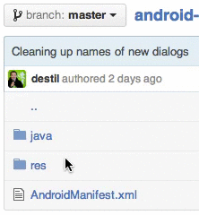

# PackageHilgertova for Chrome

This Chrome Extension saves you clicks on GitHub, BitBucket &amp; cgit while browsing Java code.

| With                            | Without                          |
| ------------------------------- |:--------------------------------:|
|       |  |

## Installation

Install it from [Chrome Web Store](https://chrome.google.com/webstore/detail/packagehilgertova/lcjmhdkkgnlhelgilgccgheboicdekpe)

## Why 'Hilgertova'?

[Štěpánka Hilgertová](http://en.wikipedia.org/wiki/%C5%A0t%C4%9Bp%C3%A1nka_Hilgertov%C3%A1) is a famous Czech canoer. She can paddle very quickly without too much thinking, just like this extension paddles through packages.

See [**our other Czech personalities**](http://inmite.github.io) who help with [#AndroidDev](https://plus.google.com/s/%23AndroidDev).

 
 

